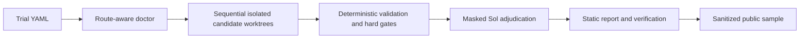

# Phase 5 judge path and flagship runbook

## Offline sample mode

Tested offline behavior is Windows CI on Node 20. Install Node 20 or newer and Git, then run:

```text
npm ci
npm run demo
npm start -- verify examples/demo-run
npm run verify:clean
```

No Codex/OpenCode credentials are required. The generated sample report is `examples/demo-run/report.html`.

## Live calibration prerequisites

Live calibration is conservatively supported only on the Windows path already exercised by Arena's native evidence. It needs Node 20+, Git, Codex, OpenCode, and existing authenticated provider routes. Execution is sequential and can consume substantial provider quota; preview budgets are upper bounds, not predictions.



Arena compares complete configurations, not isolated causal effects. Raw evidence and deterministic hard gates remain authoritative. Provider credentials, raw logs, local paths, worktrees, account/session data, and private judge responses must never enter a committed sample.

## Human-only flagship sequence

Use stage commands—not `arena calibrate`—so candidate execution is never repeated after an adjudication or reporting repair.

```powershell
git switch main
git pull --ff-only
git status --short # must be empty

$Baseline = "bca31d7c5b3cd8af70a39d3c22cf873e638b3a89"
git tag -a phase5-concurrency-scheduler-baseline -m "Phase 5 scheduler baseline" $Baseline
git push origin phase5-concurrency-scheduler-baseline

Copy-Item examples/concurrency-scheduler-phase5.yml phase5.yml
# Replace REPLACE_REPOSITORY, REPLACE_CONCURRENCY_SCHEDULER_BASELINE with $Baseline,
# and every REPLACE_*_VARIANT after credential-safe local discovery.
npm start -- preview phase5.yml
npm start -- doctor phase5.yml

# Run once for each exact candidate configuration after doctor reports ready.
npm start -- diagnose phase5.yml sol-medium-codex
npm start -- diagnose phase5.yml terra-high-codex
npm start -- diagnose phase5.yml luna-extra-high-codex
npm start -- diagnose phase5.yml terra-high-opencode-openai
npm start -- diagnose phase5.yml deepseek-v4-flash-max-opencode-go
npm start -- diagnose phase5.yml deepseek-v4-flash-max-opencode-direct

npm start -- run phase5.yml
$Run = "<completed-run-directory>"
npm start -- adjudicate $Run --dry-run --reasoning high
npm start -- adjudicate $Run --reasoning high
npm start -- report $Run
npm start -- verify $Run
npm start -- sanitize-sample $Run examples/demo-run
```

Finally run the Pages sample scan/staging path, enable **Settings → Pages → GitHub Actions**, and confirm repository visibility or judge access. Those access and deployment actions are human submission steps; the repository is currently private.

## Limits

- The source scheduler baseline intentionally fails canonical acceptance. A successful candidate worktree must pass it without modifying `fixtures/concurrency-scheduler/acceptance/`.
- Route doctoring does not invoke models. A passed doctor is readiness evidence, not a live-provider completion proof.
- Sol High is human-only stabilization. It remains separate from deterministic hard-gate authority.

